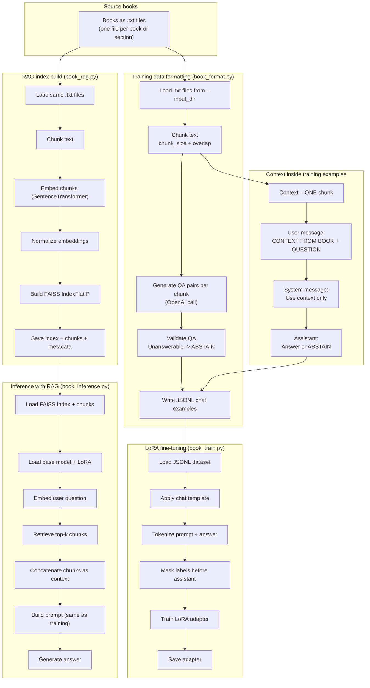

README

Chat with any book!

This is a pipeline to create a q/a chatbot that has a trained LoRa adapter (to fine tune for conversation style) and a RAG of any book(s). By default, it uses a llama-1b-instruct model to chat with the text. 

Overview

Build a RAG FAISS index using book_rag.py:

    "--input_dir", required=True, help="Directory of .txt files"
    
    "--out_dir", required=True, help="Output directory for rag artifacts"
    
    Uses a all-MiniLM-L6-v2 SentenceTransformer model by default, creates chunks with overlap that are saved as pkl files.

    
Create a RAG aligned jsonl using book_format.py:

  "--input_dir", required=True, help="Directory containing .txt files."
  
  "--output_file", required=True, help="Path to write JSONL training data."
  
  "--model", default="gpt-4o-mini", help="Model used to generate QA pairs."
  
  This json file contains q/a pairs extracted from the text using any model of your choice. 
  
  
Train LoRa on q/a pairs for conversation style using book_train.py:

  "--data_path", required=True, help="Path to formatted JSONL from book_format.py"
  
  "--base_model", default='meta-llama/Llama-3.2-1B-Instruct', help="HF base model id/path (e.g. meta-llama/..., mistralai/...)"
  
  "--output_dir", required=True
  
  
Perform inference using book_inference.py:

    "--rag_dir", required=True, help="Directory containing all_chunks.pkl, chunk_metadata.pkl, rag_index.faiss"
    
    "--embed_model", default="all-MiniLM-L6-v2", help="SentenceTransformer embedder"
    
    "--base_model", default='meta-llama/Llama-3.2-1B-Instruct', help="Base HF model id or local path (same as training base)"
    
    "--lora_path", required=True, help="Path to LoRA adapter directory"
    
    Temperature, repetition_penalty, system prompt, etc. can be adjusted to alter style or improve performance. 
    
Pipeline explained further:

