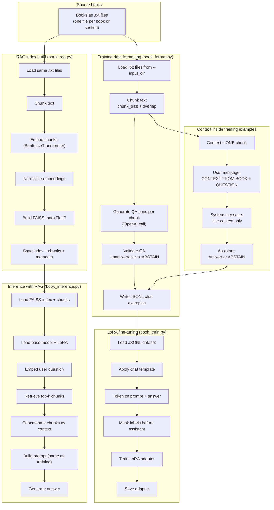
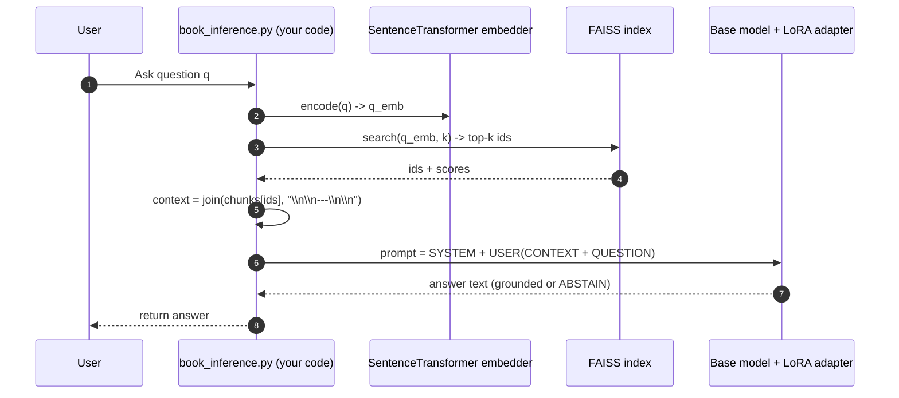

README

Overview

This project fine-tunes a chat LLM (via LoRA) to answer questions about books strictly using retrieved text passages. The pipeline is “RAG-aligned”: the same prompt structure is used during training and inference, where the user message contains a CONTEXT FROM BOOK: block plus the QUESTION:.

1) Input books

Books are provided as plain text files (.txt) in a directory (one or more files).

2) Create RAG-aligned training data (book_format.py)

book_format.py reads the .txt files and splits each book into overlapping character chunks (--chunk_size, --overlap). For each chunk, it calls an LLM to generate multiple question/answer pairs. Each training example is stored in JSONL chat format:

System message: instructs the model to only use provided context and to abstain when unsupported.

User message: contains CONTEXT FROM BOOK:\n{chunk_text}\n\nQUESTION:\n{question}.

Assistant message: contains the answer, or the exact abstention string:
I don't know based on the provided context.

In this stage, “context” = exactly one chunk of the book.

3) Build the retrieval index (book_rag.py)

book_rag.py chunks the same .txt files (same chunking scheme), embeds each chunk using a SentenceTransformer model (default all-MiniLM-L6-v2), normalizes embeddings, and builds a FAISS inner-product index (IndexFlatIP) for cosine-like similarity search. It saves three artifacts:

all_chunks.pkl (raw chunk text)

chunk_metadata.pkl (source file + chunk id)

rag_index.faiss (FAISS vector index)

4) LoRA fine-tuning (book_train.py)

book_train.py loads the JSONL training set and converts each example’s messages into a single model input string via the tokenizer’s chat template. It then masks labels so that loss is computed only on the assistant answer tokens (everything before the assistant answer is set to -100). This trains the model to generate answers conditioned on the system + user message, where the user message contains the context passage.

The script wraps the base model with LoRA (typically targeting attention projection modules) and saves the resulting adapter to disk.

5) RAG + LoRA inference (book_inference.py)

At inference time, book_inference.py loads:

the RAG artifacts (chunks/metadata/index + embedder),

the base model,

the LoRA adapter.

When the user asks a question q, the code:

embeds q,

searches the FAISS index for top-k relevant chunks,

concatenates those chunks into a single context string,

builds a chat prompt with the same training structure (CONTEXT FROM BOOK + QUESTION),

calls model.generate(...) to produce the answer.

In this stage, “context” = the concatenation of top-k retrieved chunks, and the LLM never performs retrieval; it only answers based on the context provided in the prompt.

